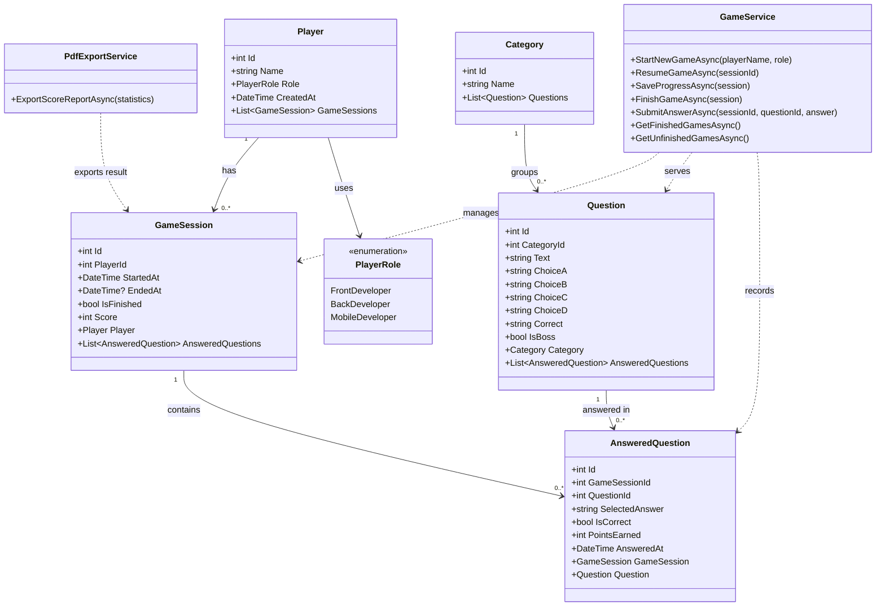

# UML Class Diagram

This diagram captures the main domain model and core services for **Clavier d'Or**.

```mermaid
classDiagram
    class Player {
      +int Id
      +string Name
      +PlayerRole Role
      +DateTime CreatedAt
      +List~GameSession~ GameSessions
    }

    class GameSession {
      +int Id
      +int PlayerId
      +DateTime StartedAt
      +DateTime? EndedAt
      +bool IsFinished
      +int Score
      +Player Player
      +List~AnsweredQuestion~ AnsweredQuestions
    }

    class Category {
      +int Id
      +string Name
      +List~Question~ Questions
    }

    class Question {
      +int Id
      +int CategoryId
      +string Text
      +string ChoiceA
      +string ChoiceB
      +string ChoiceC
      +string ChoiceD
      +string Correct
      +bool IsBoss
      +Category Category
      +List~AnsweredQuestion~ AnsweredQuestions
    }

    class AnsweredQuestion {
      +int Id
      +int GameSessionId
      +int QuestionId
      +string SelectedAnswer
      +bool IsCorrect
      +int PointsEarned
      +DateTime AnsweredAt
      +GameSession GameSession
      +Question Question
    }

    class PlayerRole {
      <<enumeration>>
      FrontDeveloper
      BackDeveloper
      MobileDeveloper
    }

    class GameService {
      +StartNewGameAsync(playerName, role)
      +ResumeGameAsync(sessionId)
      +SaveProgressAsync(session)
      +FinishGameAsync(session)
      +SubmitAnswerAsync(sessionId, questionId, answer)
      +GetFinishedGamesAsync()
      +GetUnfinishedGamesAsync()
    }

    class PdfExportService {
      +ExportScoreReportAsync(statistics)
    }

    Player "1" --> "0..*" GameSession : has
    GameSession "1" --> "0..*" AnsweredQuestion : contains
    Category "1" --> "0..*" Question : groups
    Question "1" --> "0..*" AnsweredQuestion : answered in
    Player --> PlayerRole : uses

    GameService ..> GameSession : manages
    GameService ..> Question : serves
    GameService ..> AnsweredQuestion : records
    PdfExportService ..> GameSession : exports result
```
